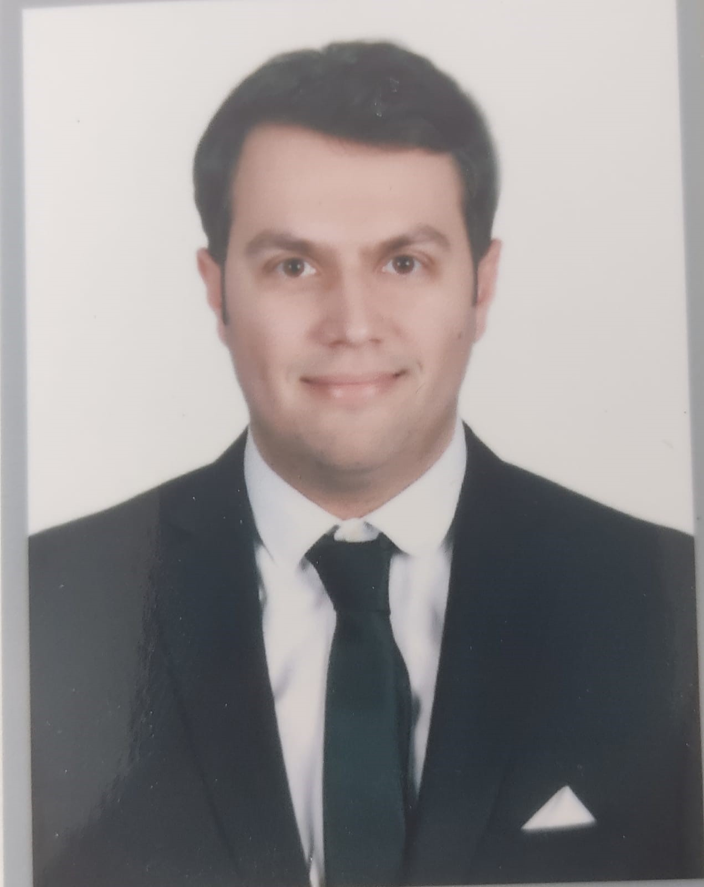

{fig-align="center" width="179"}

Ben Sarper Sarıkaya. \
Hacettepe Üniversitesi Mühendislik Yönetimi yüksek lisans programında öğrenciyim

# Eğitim

-   B.S University of Turkish Aeronautical Association, Mechanical Engineering, 2013-2019
-   M.S., Hacettepe University, Engineering Management 2026-Ongoşng

# İş Tecrübesi

## Employements

1.  Özdemirsan Treyler- Makine Mühendisi, 2019 Ekim-2019 Aralık

2.  Alpem Filtre ve Hidrolik, Proje ve Satış Mühendisi, 2020 Haziran-2021 Aralık

3.  Mitaş Endüstri, Proje Yönetimi Uzman Mühendisi, 2021 Aralık- Devam ediyor

## Internships

1.  Ges Mühendislik, Stajyer Mühendis, Ağustos 2016 - Eylül 2016

2.  MKE Maksam, Stajyer Mühendis, Ağustos 2017 - Eylül 2017

# Projects

1.  **Yenilenebilir Enerji Kaynakları ile Elektrik Üretimi, Depolaması, Kullanımı 2017 Ocak  - 2024 Aralık**

    Yenilikçi Enerji Sistemleri: Güneş panelleri ve rüzgar gülleri ile elektrik üretimi ve jel akülerde depolama sistemleri geliştirerek, ev kullanımına uygun enerji üretimi sağladım.

    Akıllı Ev Sistemleri: Mini Otomatik Sulama Sistemi geliştirerek, evdeki bitkilerin otomatik sulanmasını sağladım ve enerji verimliliğini artırdım.

2.  **Parçacık Enerjisi Ölçüm Aleti Bitirme Projesi Eylül 2017-Haziran 2018**

    Enerji Ölçüm Cihazı: Lazer teknolojisini kullanarak mermi enerjisini ve enerji kaybını ölçen bir cihaz tasarladık ve ürettik. Cihazın verimliliğini artırmak için açık alanda testler gerçekleştirdik ve verimliliğini arttırdık.

# Publications

1.  Dasdemir, E., Batta, R., Koksalan, M., Tezcaner Ozturk, D. (2022) “UAV Routing for Reconnaissance Mission: A Multi-Objective Orienteering Problem with Time-Dependent Prizes and Multiple Connections”, Computers & Operations Research, 145: 105882.

# Competencies

R, Quarto, Git, Python

# Hobbies

Spor,
